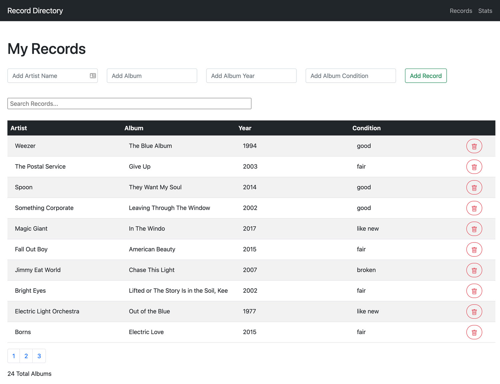
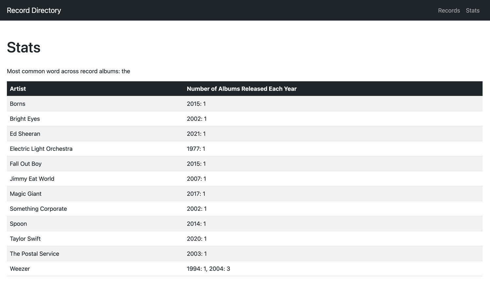

# README

## Overview

Rails and React JS CRUD application that allows users to add, remove, and update records in a record directory. Application includes pagination and users can also enter in search terms to search records across the directory.



The application also has a stats view where it displays the most common word used across albums as well as the number of albums an artist has released every year:



## Viewing the App Locally

To run the application locally, use the following commands:

```
bundle install
yarn install
rails db:create
rails db:seed
rails s
```

You can view the application locally at the following address: `http://localhost:3000/` and the endpoint can be viewed at `http://localhost:3000/api/v1/records`

## Approach

I first worked on getting the Rails application to work properly with Webpacker so that I could use React for the frontend. For the model, I considered using two different entities with a one to many relationship, Record and Artist, but then given that the application involves the user entering in just a record item, I decided to use Active Record to update all identical artist fields when a user updates one instance.

Generally when I approach an application, I am most concerned with coming up with a working solution. Once it's functional, I like to find ways to improve the code and make it as DRY as possible. With this project, I didn't get to tackle all the refactoring that I'd like to do due to the time limit, so I'm planning to revisit this in the future to make the code cleaner.

When it came to developing the stats page, which shows the most commonly used word across records and the number of albums an artist released every year, I used JavaScript to filter through and format the data. This portion of the application is actually where I believe having another model would have come in handy, since using JavaScript for the filtering didn't feel as efficient as creating another endpoint would have.

## Technologies Used

- [Rails](https://rubyonrails.org/)
- [React JS](https://reactjs.org/)
- [Bootstrap](https://getbootstrap.com/) for styling
- [Yarn](https://yarnpkg.com/) package manager for JS

## Next Steps

I would like to make the following improvements with the application:

- Convert the class components into functional ones so that all React components within the application would be functional and consistent. This would also help clean up some of the repetitive naming that was going on with the variables (`this.variableName.state`, etc).
- Create a reusable component for the form to remove some of the duplicate code that exists when users are creating new records/updating existing ones.
- Create a reusable component for the API call so there isn't repetitive code within different components.
- Remove the alert boxes and replace them with modals for a better user experience.
- Create a dropdown for the condition field so users are limited with the options they can select.
- Fix the flickering that occurs when a user clicks on the home directory view and stats view, which is tied to how the frontend is rendering.
- Create a model and endpoint for artists to make it easier to render the data on the stats view.
- Write Rspec tests for the Rails code and Jest for the React code
